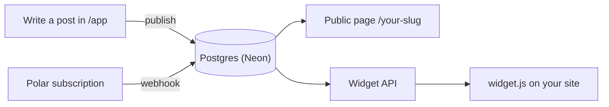

<p align="center">
  
</p>

<h1 align="center">UseChangelog</h1>

<p align="center">
  A public changelog and an in-app "What's new" widget for indie hackers and small product teams.
</p>

<p align="center">
  <a href="https://usechangelog-xi.vercel.app"><strong>Live site</strong></a> ·
  <a href="https://github.com/LEstebanR/usechangelog/issues">Roadmap</a> ·
  <a href="#run-locally">Run locally</a> ·
  <a href="#contributing">Contributing</a>
</p>

<p align="center">
  <a href="https://github.com/LEstebanR/usechangelog/actions/workflows/ci.yml"></a>
</p>

---

## Status

> **The landing page is live; the product is in development.** Sign-up isn't open yet. The MVP is built issue by issue, in the order listed in [Roadmap](#roadmap).

## What it is

Most small teams already write down what they ship, but the notes end up buried in Notion, Slack or GitHub releases, where customers never see them. UseChangelog gives a product one place to publish updates and two places where people actually read them:

- **A public changelog page** at `usechangelog.com/{slug}`.
- **A "What's new" widget**: one script tag that shows the latest posts inside the product.

Each post has:
- a **category**: New, Improved or Fixed;
- a **type**: Shipped, or Coming for what's on the way.

Posts are written in plain Markdown, saved as drafts and published when ready.

It's global, self-serve and priced in USD. Sign-up is free; publishing needs a monthly plan.

## How it works



1. **Write a post:** title, Markdown body, category and type. Save it as a draft or publish it.
2. **Get a public page:** published posts appear at `/{slug}`, with "Coming soon" first and then everything that shipped, newest first.
3. **Embed the widget:** paste one `<script>` tag. The widget's chrome is English by default, or Spanish with `lang="es"`; posts show exactly as written.

The public page and the widget only serve posts while the workspace has an **active** Polar subscription. If it lapses, nothing is deleted; the posts come back as soon as it's active again.

## Tech stack

| Layer | Choice | Status |
| --- | --- | --- |
| Framework | [Next.js 16](https://nextjs.org) (App Router, Turbopack), React 19, TypeScript | ✅ In use |
| Styling | Tailwind CSS 4, `next/font` (Funnel Display + Instrument Sans) | ✅ In use |
| Hosting | [Vercel](https://vercel.com): production on `main`, a preview per PR | ✅ In use |
| CI | GitHub Actions: lint, typecheck and build as separate jobs | ✅ In use |
| Database | [Neon](https://neon.com) Postgres, with Drizzle ORM and migrations in the repo | 🛠 Planned ([#4](https://github.com/LEstebanR/usechangelog/issues/4)) |
| Auth | Neon Managed Better Auth, magic link only | 🛠 Planned ([#4](https://github.com/LEstebanR/usechangelog/issues/4)) |
| Payments | [Polar](https://polar.sh) as merchant of record: one monthly plan, sandbox on previews | 🛠 Planned ([#14](https://github.com/LEstebanR/usechangelog/issues/14), [#15](https://github.com/LEstebanR/usechangelog/issues/15), [#17](https://github.com/LEstebanR/usechangelog/issues/17)) |

The reasoning behind each choice is in its issue. For example, [#4](https://github.com/LEstebanR/usechangelog/issues/4) explains why it's Neon's auth and not Clerk.

## Project structure

```
app/
  page.tsx              Landing page
  content.ts            All landing copy (edit text here, not in page.tsx)
  layout.tsx            Fonts, metadata, Open Graph
  globals.css           Design tokens (@theme) and motion
  latest.tsx            Rotating "Latest from Acme" feed in the hero
  reveal.tsx            Scroll reveals (IntersectionObserver)
  section-label.tsx     Section label with the brand square
  tag.tsx               New / Improved / Fixed / Coming soon tags
  icon.svg, apple-icon.png, opengraph-image.png
.github/workflows/ci.yml  CI: lint, typecheck, build
AGENTS.md               Product rules and conventions (read by AI agents and humans)
.agents/skills/         Project skills for AI agents (symlinked in .claude/skills)
.cursor/agents/         Verifier agent (symlinked in .claude/agents)
```

## Run locally

Requires Node.js 22+ and npm.

```bash
git clone https://github.com/LEstebanR/usechangelog.git
cd usechangelog
npm install
npm run dev
```

Open http://localhost:3000.

### Scripts

| Command | What it does |
| --- | --- |
| `npm run dev` | Dev server with Turbopack |
| `npm run build` | Production build |
| `npm run start` | Serve the production build |
| `npm run lint` | ESLint |
| `npm run typecheck` | `next typegen` + `tsc --noEmit` (typegen creates route types like `LayoutProps` on a clean checkout) |
| `npm run check` | Lint, typecheck and build: the same checks CI runs |

### Environment variables

The landing needs none. The variables arrive with the product issues, each documented in `.env.example` (names only, never values):

| Variable | Used for | Set by | Issue |
| --- | --- | --- | --- |
| `DATABASE_URL`, `DATABASE_URL_UNPOOLED` | Postgres connection | Neon ↔ Vercel integration | [#4](https://github.com/LEstebanR/usechangelog/issues/4) |
| `NEON_AUTH_BASE_URL` | Auth endpoint | Neon ↔ Vercel integration | [#4](https://github.com/LEstebanR/usechangelog/issues/4) |
| `NEON_AUTH_COOKIE_SECRET` | Session cookie signing | Manually | [#4](https://github.com/LEstebanR/usechangelog/issues/4) |
| `POLAR_ACCESS_TOKEN`, `POLAR_PRODUCT_ID`, `POLAR_SERVER` | Checkout and portal (`sandbox` on previews) | Manually | [#14](https://github.com/LEstebanR/usechangelog/issues/14) |
| `POLAR_WEBHOOK_SECRET` | Webhook signature check | Manually | [#15](https://github.com/LEstebanR/usechangelog/issues/15) |
| `NEXT_PUBLIC_SITE_URL` | Canonical URL and metadata | Manually | [#13](https://github.com/LEstebanR/usechangelog/issues/13) |

For local work, copy `.env.example` to `.env.local`. Real `.env*` files are git-ignored.

## Deployment

- **Production:** https://usechangelog-xi.vercel.app, deployed from `main`. There's no custom domain yet; [#24](https://github.com/LEstebanR/usechangelog/issues/24) covers it.
- **Previews:** every pull request gets its own Vercel preview. Its URL goes in the PR description.
- **CI:** [GitHub Actions](.github/workflows/ci.yml) runs `lint`, `typecheck` and `build` as separate checks on every PR and on each push to `main`.

## Roadmap

The issue tracker is the backlog. Issues are ordered by priority, and within a priority by dependencies. Each one lists its dependencies, decisions and a "Hecho cuando" (done when) checklist.

| Priority | Meaning |
| --- | --- |
| **P0** | Core product and billing: nothing works without it |
| **P1** | Needed before opening sign-up to the public |
| **P2** | After launch |

| # | Priority | Issue | |
| --- | --- | --- | --- |
| 1 | P0 | Auth: database and magic-link sign-in | [#4](https://github.com/LEstebanR/usechangelog/issues/4) |
| 2 | P0 | Workspace: onboarding, public slug, settings | [#5](https://github.com/LEstebanR/usechangelog/issues/5) |
| 3 | P0 | Posts: create, edit and publish | [#6](https://github.com/LEstebanR/usechangelog/issues/6) |
| 4 | P0 | Public page: the changelog at `/{slug}` | [#7](https://github.com/LEstebanR/usechangelog/issues/7) |
| 5 | P0 | Widget: embeddable script with the latest posts | [#8](https://github.com/LEstebanR/usechangelog/issues/8) |
| 6 | P0 | Billing: Polar checkout, one monthly plan | [#14](https://github.com/LEstebanR/usechangelog/issues/14) |
| 7 | P0 | Billing: Polar webhook and subscription state | [#15](https://github.com/LEstebanR/usechangelog/issues/15) |
| 8 | P0 | Billing: publish only with an active plan | [#16](https://github.com/LEstebanR/usechangelog/issues/16) |
| 9 | P0 | Billing: Polar customer portal | [#17](https://github.com/LEstebanR/usechangelog/issues/17) |
| 10 | P1 | Legal: privacy and terms | [#18](https://github.com/LEstebanR/usechangelog/issues/18) |
| 11 | P1 | Feedback: users write to us from the app | [#28](https://github.com/LEstebanR/usechangelog/issues/28) |
| 12 | P1 | Quality: tests for the critical rules | [#12](https://github.com/LEstebanR/usechangelog/issues/12) |
| 13 | P1 | Config: documented env vars and site URL | [#13](https://github.com/LEstebanR/usechangelog/issues/13) |
| 14 | P1 | Launch: open sign-up from the landing | [#9](https://github.com/LEstebanR/usechangelog/issues/9) |
| 15 | P1 | Launch: end-to-end check of the MVP | [#10](https://github.com/LEstebanR/usechangelog/issues/10) |
| 16 | P2 | SEO: metadata, sitemap, robots | [#19](https://github.com/LEstebanR/usechangelog/issues/19) |
| 17 | P2 | Domain: usechangelog.com and branded auth email | [#24](https://github.com/LEstebanR/usechangelog/issues/24) |
| 18 | P2 | Auth: sign in with Google | [#25](https://github.com/LEstebanR/usechangelog/issues/25) |

### Out of scope

Kept out on purpose:
- waitlist, voting, comments, reactions;
- RSS, email digests, scheduled posts;
- custom domains per workspace, an unread badge in the widget;
- teams and roles, SSO;
- Stripe, trials, a free tier that publishes;
- translations, apart from the widget's Spanish chrome.

The full list lives in [`AGENTS.md`](AGENTS.md#product-rules).

## Design

The landing is the **Quiet grid** direction. It has five parts:

- **Background:** white, over a faint 12-column grid that headings align to.
- **Type:**
  - Funnel Display for display text;
  - Instrument Sans for body text.
- **Colors:**
  - ink-blue accent `#1D3A8F`;
  - tag colors: blue for New, green for Improved, clay for Fixed.
- **Motion:** sober, and it respects `prefers-reduced-motion`.
- **Copy:** all of it lives in `app/content.ts`.

Lighthouse on the production build: **98 / 100 / 100 / 100** on mobile and **100 / 100 / 100 / 100** on desktop (performance, accessibility, best practices, SEO).

## Contributing

- **One issue, one branch, one PR,** opened from an up-to-date `main`. PRs are ready for review, never draft; the owner merges.
- **The PR description** carries the Vercel preview URL and `Closes #<issue>`, so GitHub closes the issue on merge. Issue and PR templates live in `.github/`.
- **Language:** code, commits, UI copy and PRs are in English; issues are in Spanish.
- **Never commit secrets** or `.env*` files (except `.env.example`).

### Working with AI agents

[`AGENTS.md`](AGENTS.md) is the source of truth for product rules and conventions, and [`CLAUDE.md`](CLAUDE.md) imports it. The repo ships its own agent tooling:

| Tool | Purpose |
| --- | --- |
| `mvp-scope` | What's in the MVP, checked before adding a feature |
| `polar-billing` | How to implement checkout, webhook, subscription states and the publish gate |
| `clerk-auth` | Superseded: [#4](https://github.com/LEstebanR/usechangelog/issues/4) replaces it with Neon's auth skill |
| `write-issue` | How to write an issue that can be built without guessing |
| `next-dev-loop` | Official Next.js skill to verify changes in a running `next dev` |
| `verifier` agent | Runs lint, typecheck, build and tests, and reports without editing code |
