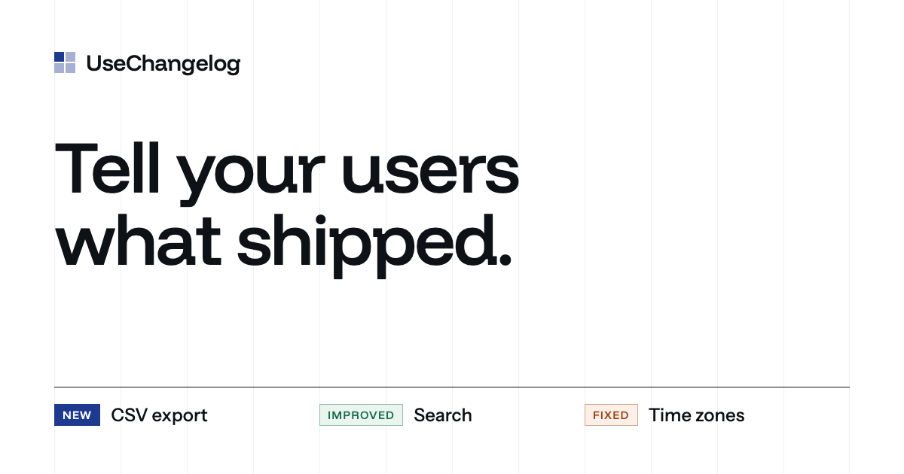
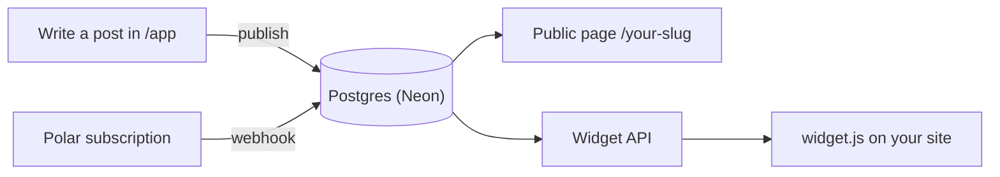

<p align="center">
  
</p>

<h1 align="center">UseChangelog</h1>

<p align="center">
  A public changelog and an in-app "What's new" widget for indie hackers and small product teams.
</p>

<p align="center">
  <a href="https://www.usechangelog.com"><strong>Live site</strong></a> ·
  <a href="https://github.com/LEstebanR/usechangelog/issues">Roadmap</a> ·
  <a href="#run-locally">Run locally</a> ·
  <a href="#contributing">Contributing</a>
</p>

<p align="center">
  <a href="https://github.com/LEstebanR/usechangelog/actions/workflows/ci.yml"></a>
</p>

---

## Status

> **Live at [usechangelog.com](https://www.usechangelog.com).** Sign up is free; publishing, the public page and the widget need the monthly plan, billed by Polar. The MVP was built issue by issue, in the order listed in [Roadmap](#roadmap); see [End-to-end check](#end-to-end-check) for how it's verified.

## What it is

Most small teams already write down what they ship, but the notes end up buried in Notion, Slack or GitHub releases, where customers never see them. UseChangelog gives a product one place to publish updates and two places where people actually read them:

- **A public changelog page** at `usechangelog.com/{slug}`.
- **A "What's new" widget**: one script tag that shows the latest posts inside the product.

Each post has:
- a **category**: New, Improved or Fixed;
- a **type**: Shipped, or Coming for what's on the way.

Posts are written in plain Markdown, saved as drafts and published when ready.

It's global, self-serve and priced in USD. Sign-up is free; publishing needs a monthly plan.

## How it works



1. **Write a post:** title, Markdown body, category and type. Save it as a draft or publish it.
2. **Get a public page:** published posts appear at `/{slug}`, with "Coming soon" first and then everything that shipped, newest first.
3. **Embed the widget:** paste one `<script>` tag. The widget's chrome is English by default, or Spanish with `lang="es"`; posts show exactly as written.

The public page and the widget only serve posts while the workspace has an **active** Polar subscription. If it lapses, nothing is deleted; the posts come back as soon as it's active again.

## Tech stack

| Layer | Choice | Status |
| --- | --- | --- |
| Framework | [Next.js 16](https://nextjs.org) (App Router, Turbopack), React 19, TypeScript | ✅ In use |
| Styling | Tailwind CSS 4, `next/font` (Funnel Display + Instrument Sans) | ✅ In use |
| Hosting | [Vercel](https://vercel.com): production on `main`, a preview per PR | ✅ In use |
| CI | GitHub Actions: lint, typecheck, build and test as separate jobs | ✅ In use |
| Package manager | [Bun](https://bun.sh) | ✅ In use |
| Database | [Neon](https://neon.com) Postgres, with Drizzle ORM and migrations in the repo | ✅ In use |
| Auth | Neon Managed Better Auth, magic link only | ✅ In use |
| Payments | [Polar](https://polar.sh) as merchant of record: one monthly plan, sandbox on previews | ✅ In use |
| Analytics | [Vercel Web Analytics](https://vercel.com/docs/analytics): cookieless page views on the site and public changelogs (`@vercel/analytics`) | ✅ In use |

The reasoning behind each choice is in its issue. For example, [#4](https://github.com/LEstebanR/usechangelog/issues/4) explains why it's Neon's auth and not Clerk.

## Project structure

```
app/
  page.tsx              Landing page
  content.ts            All landing copy (edit text here, not in page.tsx)
  layout.tsx            Fonts, metadata, Open Graph
  not-found.tsx         404 page (unknown routes and notFound())
  privacy/, terms/      Privacy policy and terms (shell in legal-page.tsx)
  site-footer.tsx       Footer of the landing, the public page and the legal pages (brand, Privacy · Terms)
  layout-styles.ts      Page width and gutters shared by those pages
  sitemap.ts, robots.ts SEO: the public pages and changelogs with a post; /app, sign-in and /api blocked
  globals.css           Design tokens (@theme) and motion
  latest.tsx            Rotating "Latest from Acme" feed in the hero
  reveal.tsx            Scroll reveals (IntersectionObserver)
  section-label.tsx     Section label with the brand square
  tag.tsx               New / Improved / Fixed / Coming soon tags
  markdown-body.tsx     A post body rendered from Markdown (styles in markdown-styles.ts)
  [slug]/               The public changelog at /{slug}, rendered on every request
  api/widget/[key]/     Public widget data (CORS open, 60-second CDN cache)
  api/polar/            Polar checkout, customer portal and webhook (the only writer of subscription state)
  icon.svg, apple-icon.png, opengraph-image.png
  (auth)/sign-in/       Magic link sign-in
  app/                  The signed-in app: /app (posts), /app/posts/new, /app/posts/[id], /app/onboarding, /app/settings, /app/billing
  api/auth/[...path]/   Auth handler, proxied to Neon
lib/auth/               Server auth client and Server Actions (sign in, sign out)
lib/workspace/          Slug rules, form parsing, getCurrentWorkspace(), getWorkspaceBySlug() and workspace Server Actions
lib/posts/              Post form parsing, workspace-scoped queries and post Server Actions
lib/billing/            Polar config, mapPolarStatus(), canPublish() (the one publish gate) and the webhook handler
lib/markdown.ts         renderMarkdown(): safe Markdown to HTML for the public page and the widget
lib/widget/             The widget's words in 5 languages and the API payload
public/widget.js        The embeddable "What's new" widget (vanilla JS, Shadow DOM)
scripts/smoke-app.ts    Signed-in smoke test (`bun run smoke`)
scripts/widget-test.ts  Host pages to try the widget from another origin (`bun run widget-test`)
db/
  schema.ts             Our tables (public schema): workspaces, posts
  neon-auth.ts          Read-only view of Neon's user table, for foreign keys
  migrations/           SQL migrations generated by drizzle-kit
proxy.ts                Redirects /app to /sign-in without a session
.github/workflows/ci.yml  CI: lint, typecheck, build
AGENTS.md               Product rules and conventions (read by AI agents and humans)
.agents/skills/         Project skills for AI agents (symlinked in .claude/skills)
.cursor/agents/         Verifier agent (symlinked in .claude/agents)
```

## Run locally

Requires Node.js 22+ and Bun.

```bash
git clone https://github.com/LEstebanR/usechangelog.git
cd usechangelog
bun install
bun run dev
```

Open http://localhost:3000.

### Scripts

| Command | What it does |
| --- | --- |
| `bun run dev` | Dev server with Turbopack |
| `bun run build` | Production build |
| `bun run start` | Serve the production build |
| `bun run lint` | ESLint |
| `bun run typecheck` | `next typegen` + `tsc --noEmit` (typegen creates route types like `LayoutProps` on a clean checkout) |
| `bun run check` | Lint, typecheck, build and tests |
| `bun run test` | Unit tests with `bun test` (`*.test.ts`) |
| `bun run db:generate` | Generate a migration from `db/schema.ts` |
| `bun run db:migrate` | Apply pending migrations (uses `DATABASE_URL_UNPOOLED`) |
| `bun run check-env` | Check the required env vars and their format, without printing them. Locally it also checks the database and auth answer. Vercel runs it before migrating |
| `bun run polar:state <slug>` | Read only: a workspace's subscription in our database next to what Polar has, and what differs. Uses `.env.local` (develop + sandbox); for production, see below |
| `bun run widget-test <widget-key> [base-url] [port]` | Host pages on another origin (`localhost:5050`) that load the widget: floating button, trigger + Spanish, hostile CSS, invalid key. For a protected preview, set `VERCEL_AUTOMATION_BYPASS_SECRET` |
| `bun run smoke <email> [base-url]` | Signed-in smoke test of `/app`. Reuses the last session (`.smoke-session-*.json`, git-ignored), so it only sends a magic link when that expires; `SMOKE_LINK=<link>` skips the request. Never writes data, and refuses production URLs unless `SMOKE_ALLOW_PRODUCTION=1` |

### Environment variables

Every variable the code reads is in `.env.example`, by name only. `bun run check-env` checks the required ones and their format without printing them. Vercel runs it before every deploy, and locally it also checks that the database and auth answer.

| Variable | Used for | Preview | Production | Where the value comes from |
| --- | --- | --- | --- | --- |
| `DATABASE_URL`, `DATABASE_URL_UNPOOLED` | Postgres (pooled for the app, direct for migrations) | `develop` branch | `production` branch | Neon → the branch → Connect |
| `NEON_AUTH_BASE_URL` | Managed Better Auth endpoint | `develop` branch | `production` branch | Neon → the branch → Auth |
| `NEON_AUTH_COOKIE_SECRET` | Session cookie signing | Random, 32+ chars | Random, 32+ chars | `openssl rand -base64 32` |
| `POLAR_ACCESS_TOKEN` | Checkout, portal, plan price | Sandbox token | Production token | Polar → Settings → Developers (scopes: `checkouts:write`, `customer_sessions:write`, `products:read`, `subscriptions:read`) |
| `POLAR_PRODUCT_ID` | The monthly plan | Sandbox product | Production product | Polar → Products |
| `POLAR_SERVER` | Which Polar to call | `sandbox` | `production` | Fixed; `check-env` enforces it |
| `POLAR_WEBHOOK_SECRET` | Webhook signature check | Sandbox endpoint secret | Production endpoint secret | Polar → Settings → Webhooks. Locally, the secret `polar listen` prints |
| `POLAR_ALLOW_DISCOUNT_CODES` | Optional and temporary: discount field in the checkout during Polar's account review | — | Only during the review | Set by hand, delete after |
| `NEXT_PUBLIC_SITE_URL` | Canonical URL for metadata (`metadataBase`, `og:url`) | Unset: the preview's own URL (`VERCEL_URL`) | `https://www.usechangelog.com` | Fixed |
| `FEEDBACK_SLACK_WEBHOOK_URL` | Optional: a copy of each feedback message in Slack | — (unset, so previews don't post) | A Slack incoming webhook | Slack → Apps → Incoming Webhooks |
| `VERCEL_AUTOMATION_BYPASS_SECRET` | Optional, local only: `widget-test` and `smoke` against a protected preview | — | — | Vercel → Deployment Protection → Protection Bypass for Automation |
| `SMOKE_LINK`, `SMOKE_ALLOW_PRODUCTION` | Optional, local only: `bun run smoke` | — | — | You |
| `VERCEL`, `VERCEL_ENV`, `VERCEL_URL` | Which environment this is | Set by Vercel | Set by Vercel | Never set them yourself |

**Running locally, step by step:**
1. `cp .env.example .env.local`.
2. Fill in the Neon values from the `develop` branch (Connect for the URLs, Auth for the auth URL). If `develop` is missing, see [Local database](#local-database).
3. `NEON_AUTH_COOKIE_SECRET`: any random 32+ characters.
4. Polar: the sandbox organization's token and product. For the webhook secret, see [Billing webhooks locally](#billing-webhooks-locally).
5. Leave `NEXT_PUBLIC_SITE_URL` and the optional ones empty.
6. `bun run check-env`, then `bun run dev`.

### Reading feedback

Users send feedback from **Feedback** in the app's nav (#28). Every message is in the `feedback` table, and in Slack when `FEEDBACK_SLACK_WEBHOOK_URL` is set. To read the latest ones in Neon's SQL editor:

```sql
select f.created_at, f.kind, u.email, w.slug, f.page, f.message
from feedback f
join neon_auth."user" u on u.id = f.user_id
left join workspaces w on w.id = f.workspace_id
order by f.created_at desc
limit 50;
```

Answer by email, by hand.

### Checking a production subscription

`bun run polar:state <slug>` reads whatever env it runs with. To point it at production without keeping production secrets around:

```bash
vercel env pull /tmp/usechangelog.prod.env --environment=production
set -a && . /tmp/usechangelog.prod.env && set +a && bun run polar:state <slug>
rm /tmp/usechangelog.prod.env
```

It never writes. Delete the file right after: it holds production's database and Polar credentials.

### Local database

Local dev and previews share the `develop` Neon branch. It must not expire: create or recreate it with `neonctl branches create --name develop --parent production`, not from the Neon console (its "Automatically delete branch after" is on by default). Then copy its connection strings and auth URL into `.env.local`, run `bun run db:migrate`, and add `http://localhost:3000` to its auth domains (`neonctl neon-auth domain add http://localhost:3000 --branch develop`).

### Billing webhooks locally

Polar can't reach `localhost`, so the [Polar CLI](https://polar.sh/docs/integrate/cli/webhooks) forwards sandbox events:

```bash
polar listen http://localhost:3000/api/polar/webhook
```

- It asks for the environment (Sandbox) and the organization interactively, so run it in its own terminal, not through a tool without a keyboard.
- It prints its own secret. Put that one in `.env.local` as `POLAR_WEBHOOK_SECRET`; the secret of the sandbox endpoint in the Polar dashboard is for previews.
- Pay with Polar's test card `4242 4242 4242 4242`, any future date and any CVC. `bun run polar:state <slug>` shows whether the webhook landed.

## Deployment

- **Production:** https://www.usechangelog.com (`usechangelog.com` redirects there), deployed from `main`. Neon Auth on the `production` branch trusts `https://www.usechangelog.com`, and the Polar production webhook points to `https://www.usechangelog.com/api/polar/webhook`; a webhook doesn't follow the redirect. The branded auth email is still [#24](https://github.com/LEstebanR/usechangelog/issues/24).
- **Previews:** every pull request gets its own Vercel preview, with its own Neon branch and auth. Its URL goes in the PR description.
- **Migrations:** Vercel runs `vercel-build`: it checks the env vars (`check-env`), applies pending migrations to the deployment's database, then runs `next build`.
- **Billing:** Production uses Polar's production organization; previews and local use its sandbox (`POLAR_SERVER`, enforced by `check-env`). Polar sends webhooks to `/api/polar/webhook`; for a protected preview, the sandbox endpoint uses the branch URL with `?x-vercel-protection-bypass=<secret>`. Locally, `polar listen` forwards them.
- **CI:** [GitHub Actions](.github/workflows/ci.yml) runs `lint`, `typecheck`, `build` and `test` as separate checks on every PR and on each push to `main`.

## End-to-end check

The manual run-through of the whole product (#10). Run it on a preview with Polar sandbox before a release, and on production with your own account. There is no demo button and no test data in production. The automated part is `bun run test` (the rules in `lib/`); everything below is what a person checks.

| # | Step | Expected |
| --- | --- | --- |
| 1 | Open the landing and click **Get started** | `/signup` lands on `/sign-in`. The closing section shows the plan's price and trial, read from Polar |
| 2 | Ask for the magic link, open it from the email | You land in `/app` (onboarding the first time) |
| 3 | Onboarding: name the workspace and pick its slug | `/app` with the public URL `/{slug}` |
| 4 | Write 4 posts: New, Improved and Fixed as Shipped, and one Coming soon. Try **Publish** | "You don't have an active subscription. Subscribe to publish…", nothing is saved as published |
| 5 | **Billing → Subscribe**, pay in Polar's checkout (sandbox: `4242 4242 4242 4242`) | Back on `/app/billing`: "Free trial" or "Active" within a few seconds (the webhook) |
| 6 | Publish the 4 posts, open `/{slug}` | The posts are there, "Coming soon" first |
| 7 | Install the widget using only **Settings → Widget**: a static HTML page and a Next.js app with a CSP (`bun run widget-test <key> [url]` serves host pages). Also with `lang="es"` | The panel shows the posts, in English and in Spanish, with no errors or warnings in the console |
| 8 | **Manage subscription → Cancel** in Polar's portal. Then revoke it (Polar → Sales → Subscriptions) | "Ends on <date>" after cancelling. After revoking: `/{slug}` is a 404, the widget shows nothing, and `/app` shows the banner. The posts stay in the app |
| 9 | Send feedback from the app | After [#28](https://github.com/LEstebanR/usechangelog/issues/28), which isn't built yet |
| 10 | **Sign out** | `/app` redirects to `/sign-in` |

**Runs so far:**
- **Local, Polar sandbox, 2026-10-07:**
  - steps 1–5 and 8 passed, plus the trial, ending the trial with a $9.99 charge, uncancelling and a simulated `past_due` (banner and a link to the portal);
  - the checkout opened from a tampered URL still used the session's workspace and email.
  - Step 6 (publishing with a plan) wasn't run, by the owner's choice. Step 7 was verified when the widget shipped (#8, `bun run widget-test`).
- **Production, 2026-10-08:**
  - Polar's account review went through the production checkout;
  - every webhook delivery to `https://www.usechangelog.com/api/polar/webhook` returned 200;
  - an unsigned request returned 403;
  - `/`, `/sign-in`, `/privacy` and `/terms` answer.
  - A full production pass with a real subscription is the owner's to run.

## Roadmap

The issue tracker is the backlog. Issues are numbered in build order; each one lists its dependencies, decisions and a "Hecho cuando" (done when) checklist.

| # | Issue | |
| --- | --- | --- |
| 1 | Database and auth: Neon + magic link | [#4](https://github.com/LEstebanR/usechangelog/issues/4) |
| 2 | Workspace: onboarding, slug, settings | [#5](https://github.com/LEstebanR/usechangelog/issues/5) |
| 3 | Post admin: create, edit, publish | [#6](https://github.com/LEstebanR/usechangelog/issues/6) |
| 4 | Public changelog page | [#7](https://github.com/LEstebanR/usechangelog/issues/7) |
| 5 | Embeddable widget | [#8](https://github.com/LEstebanR/usechangelog/issues/8) |
| 6 | Tests for the critical rules | [#12](https://github.com/LEstebanR/usechangelog/issues/12) |
| 7 | Polar checkout: one monthly plan | [#14](https://github.com/LEstebanR/usechangelog/issues/14) |
| 8 | Polar webhook and subscription state | [#15](https://github.com/LEstebanR/usechangelog/issues/15) |
| 9 | Publishing, page and widget only with an active plan | [#16](https://github.com/LEstebanR/usechangelog/issues/16) |
| 10 | Polar customer portal | [#17](https://github.com/LEstebanR/usechangelog/issues/17) |
| 11 | Environment variables and site URL | [#13](https://github.com/LEstebanR/usechangelog/issues/13) |
| 12 | Privacy and terms | [#18](https://github.com/LEstebanR/usechangelog/issues/18) |
| 13 | SEO: metadata, sitemap, robots | [#19](https://github.com/LEstebanR/usechangelog/issues/19) |
| 14 | Landing: open sign-up | [#9](https://github.com/LEstebanR/usechangelog/issues/9) |
| 15 | End-to-end check of the MVP | [#10](https://github.com/LEstebanR/usechangelog/issues/10) |
| 16 | Custom domain and branded auth email *(post-MVP)* | [#24](https://github.com/LEstebanR/usechangelog/issues/24) |
| 17 | Sign in with Google *(post-MVP)* | [#25](https://github.com/LEstebanR/usechangelog/issues/25) |
| 19 | Delete your account | [#31](https://github.com/LEstebanR/usechangelog/issues/31) |
| 20 | Custom 404 page | [#33](https://github.com/LEstebanR/usechangelog/issues/33) |

### Out of scope

Kept out on purpose:
- waitlist, voting, comments, reactions;
- RSS, email digests, scheduled posts;
- custom domains per workspace, an unread badge in the widget;
- teams and roles, SSO;
- Stripe, a free tier that publishes without a subscription;
- translations, apart from the widget's Spanish chrome.

The full list lives in [`AGENTS.md`](AGENTS.md#product-rules).

## Design

The landing is the **Quiet grid** direction. It has five parts:

- **Background:** white, over a faint 12-column grid that headings align to.
- **Type:**
  - Funnel Display for display text;
  - Instrument Sans for body text.
- **Colors:**
  - ink-blue accent `#1D3A8F`;
  - tag colors: blue for New, violet for Improved, green for Fixed (one palette in `app/tag.tsx`).
- **Motion:** sober, and it respects `prefers-reduced-motion`.
- **Copy:** all of it lives in `app/content.ts`.

Lighthouse on the production build: **98 / 100 / 100 / 100** on mobile and **100 / 100 / 100 / 100** on desktop (performance, accessibility, best practices, SEO).

## Contributing

- **One issue, one branch, one PR,** opened from an up-to-date `main`. PRs are ready for review, never draft; the owner merges.
- **The PR description** carries the Vercel preview URL and `Closes #<issue>`, so GitHub closes the issue on merge. Issue and PR templates live in `.github/`.
- **Language:** code, commits, UI copy and PRs are in English; issues are in Spanish.
- **Never commit secrets** or `.env*` files (except `.env.example`).

### Working with AI agents

[`AGENTS.md`](AGENTS.md) is the source of truth for product rules and conventions, and [`CLAUDE.md`](CLAUDE.md) imports it. The repo ships its own agent tooling:

| Tool | Purpose |
| --- | --- |
| `mvp-scope` | What's in the MVP, checked before adding a feature |
| `polar-billing` | How to implement checkout, webhook, subscription states and the publish gate |
| `auth` | How sign-in, the session and `/app` protection work |
| `neon-auth` | Official Neon skill for Managed Better Auth (vendored, not edited) |
| `write-issue` | How to write an issue that can be built without guessing |
| `develop-issue` | The full process to develop an issue: plan checkpoint, implementation, preview verification, `simplify`, `code-review`, README update, PR |
| `next-dev-loop` | Official Next.js skill to verify changes in a running `next dev` |
| `verifier` agent | Runs lint, typecheck, build and tests, and reports without editing code |

Every project skill ends with an **improvements** step: it lists what could be better and asks the owner which changes to apply.
